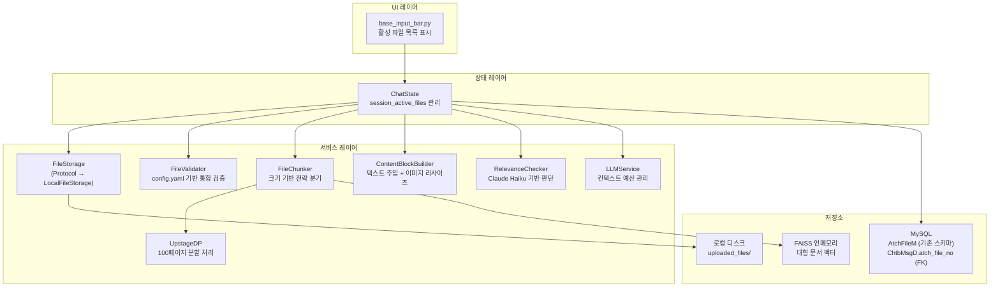
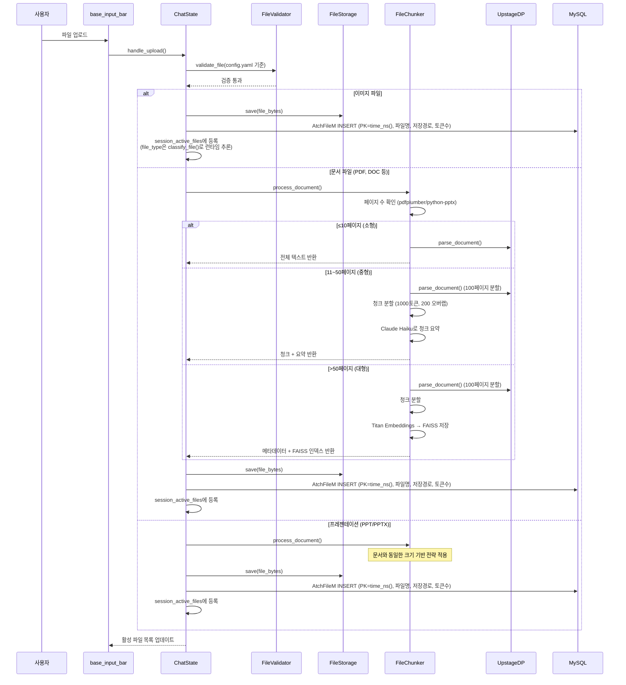
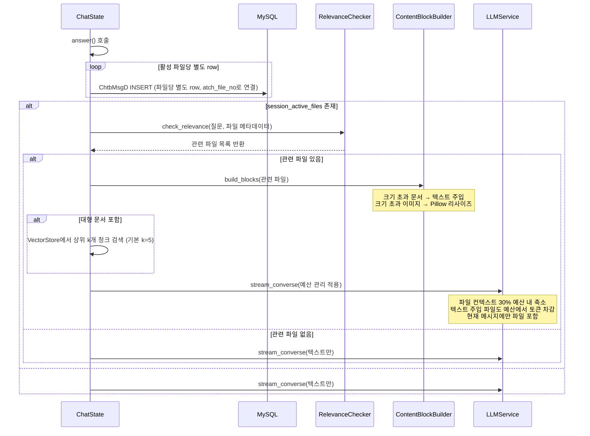
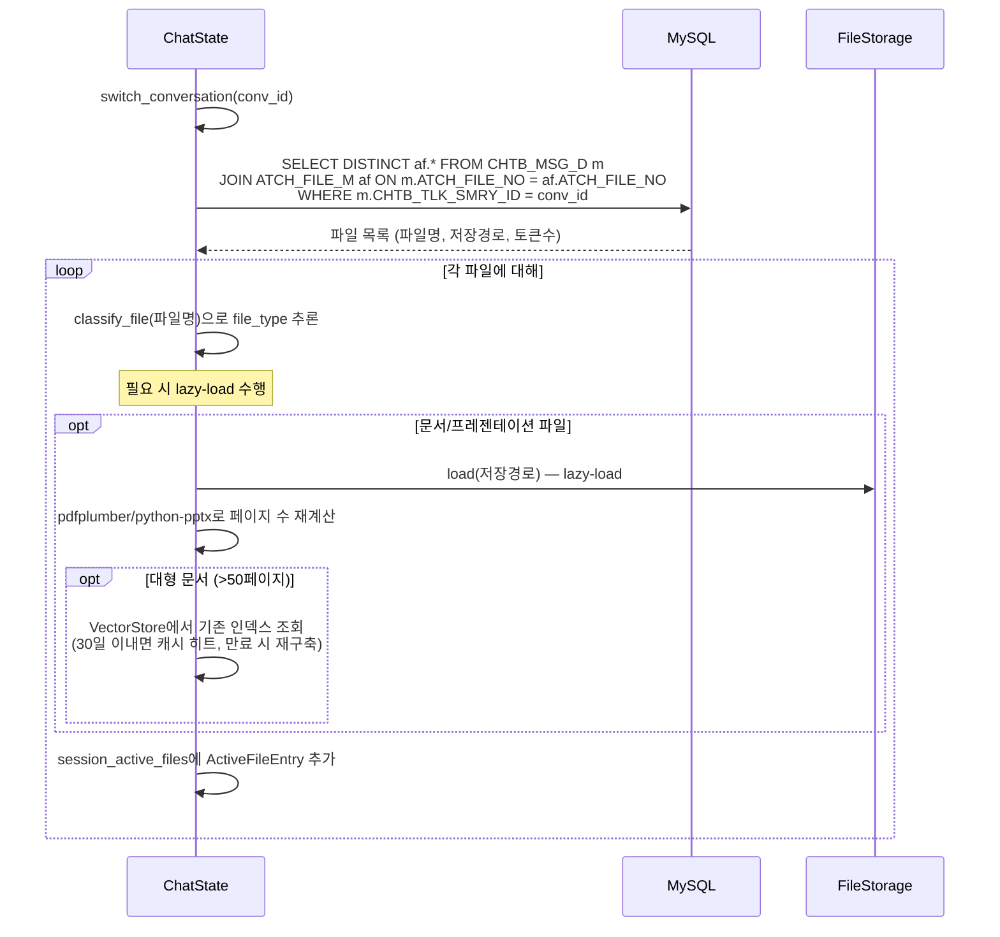

# 설계 문서: 파일 컨텍스트 최적화 (File Context Optimization)

## 개요

WellBot의 파일 활용 시스템을 근본적으로 재설계하여, 현재의 단일 턴 파일 첨부 방식에서 세션 기반 영속 파일 관리 시스템으로 전환한다. 핵심 목표는 다음과 같다:

1. **파일 영속성**: 업로드된 파일이 대화 세션 전체에서 유지되어, 매 턴마다 재첨부 없이 참조 가능
2. **API 제한 우회**: Bedrock Converse API의 파일 크기/개수 제한을 텍스트 주입 및 이미지 리사이즈로 내부 처리
3. **대용량 문서 지원**: 크기 기반 전략 분기(소형/중형/대형)와 Upstage DP 100페이지 제한 우회
4. **선택적 주입(Agentic RAG)**: 파일 컨텍스트가 필요한 질문에만 선택적으로 주입하여 토큰 절약
5. **컨텍스트 예산 관리**: 시스템(5%), 파일(30%), 이력(50%), 질문(15%) 비율로 토큰 예산 배분

### 현재 아키텍처의 한계

- `ChatState._file_data`가 `answer()` 완료 후 초기화되어 파일이 단일 턴에서만 사용됨
- Bedrock API의 ImageBlock(3.75MB), DocumentBlock(4.5MB) 제한이 사용자에게 직접 노출
- Upstage DP의 100페이지 제한으로 대용량 프레젠테이션 처리 불가
- 파일 컨텍스트가 항상 주입되어 불필요한 토큰 소비 발생
- `trim_history()`가 파일 컨텍스트를 고려하지 않는 단순 슬라이딩 윈도우 방식

### 설계 원칙: 기존 DB 스키마 활용

본 설계는 **기존 AtchFileM 테이블의 스키마를 변경하지 않는다**. 기존 컬럼(`atch_file_no`, `atch_file_nm`, `atch_file_url_addr`, `atch_file_tokn_ecnt`)만 활용하며, 파일 타입·크기·페이지 수 등 추가 메타데이터는 Session_Active_Files 인메모리 dict에서 관리한다. 대화별 파일 연결은 기존 `ChtbMsgD.atch_file_no` FK를 통해 수행한다.

### 핵심 설계 결정

1. **다중 파일 연결**: `ChtbMsgD.atch_file_no`가 단일 BIGINT이므로, 한 메시지에 여러 파일이 첨부된 경우 **파일당 별도 ChtbMsgD row를 INSERT**한다. 메시지 조회 시 `(CHTB_TLK_ID, CHTB_TLK_SEQ)` 기준으로 그룹핑하여 중복을 처리한다.
2. **AtchFileM PK 생성**: DDL에 `AUTO_INCREMENT` 없음. 애플리케이션에서 `int(time.time_ns())`로 생성한다.
3. **벡터 저장소 추상화**: FAISS 인메모리를 기본으로 사용하되, `VectorStore` Protocol로 추상화하여 향후 AWS S3 Vectors 등으로 교체 가능하게 한다.
4. **벡터 데이터 생명주기**: VectorStoreEntry는 생성 후 **30일간 유지**하며, 만료된 엔트리는 주기적으로 정리한다.

## 아키텍처

### 전체 시스템 구조



### 파일 업로드 및 처리 흐름



### 메시지 전송 시 파일 연결 및 컨텍스트 주입 흐름



### 대화 전환 시 파일 복원 흐름



## 컴포넌트 및 인터페이스

### 1. FileStorage Protocol

```python
# wellbot/services/file_storage.py

from typing import Protocol

class FileStorage(Protocol):
    """파일 바이트의 물리적 저장을 담당하는 추상 인터페이스."""

    def save(self, session_id: str, filename: str, data: bytes) -> str:
        """파일을 저장하고 저장 경로를 반환한다."""
        ...

    def load(self, path: str) -> bytes:
        """저장 경로에서 파일 바이트를 로드한다."""
        ...

    def delete(self, path: str) -> None:
        """저장된 파일을 삭제한다."""
        ...


class LocalFileStorage:
    """로컬 파일시스템 기반 FileStorage 구현체."""

    def __init__(self, base_dir: str = "uploaded_files"):
        self.base_dir = base_dir

    def save(self, session_id: str, filename: str, data: bytes) -> str:
        """uploaded_files/{session_id}/{filename} 경로에 저장."""
        ...

    def load(self, path: str) -> bytes:
        ...

    def delete(self, path: str) -> None:
        ...
```

### 2. FileChunker

```python
# wellbot/services/file_chunker.py

from dataclasses import dataclass
from enum import Enum

class DocumentSize(Enum):
    SMALL = "small"    # ≤10페이지
    MEDIUM = "medium"  # 11~50페이지
    LARGE = "large"    # >50페이지

@dataclass
class ChunkResult:
    """문서 처리 결과."""
    size_category: DocumentSize
    full_text: str | None           # 소형: 전체 텍스트
    chunks: list[str] | None        # 중형: 청크 목록
    summaries: list[str] | None     # 중형: 청크별 요약
    faiss_index_id: str | None      # 대형: FAISS 인덱스 식별자
    page_count: int
    token_count: int

class FileChunker:
    """대용량 문서를 크기 기반 전략으로 처리하는 모듈."""

    CHUNK_SIZE: int = 1000       # 토큰
    CHUNK_OVERLAP: int = 200     # 토큰
    SMALL_THRESHOLD: int = 10    # 페이지
    LARGE_THRESHOLD: int = 50    # 페이지
    UPSTAGE_PAGE_LIMIT: int = 100

    async def process_document(
        self, file_bytes: bytes, filename: str, session_id: str
    ) -> ChunkResult:
        """파일을 분석하고 크기에 따른 전략을 적용한다."""
        ...

    def _count_pages(self, file_bytes: bytes, filename: str) -> int:
        """pdfplumber 또는 python-pptx로 페이지/슬라이드 수를 확인한다."""
        ...

    async def _split_and_parse(
        self, file_bytes: bytes, filename: str, total_pages: int
    ) -> str:
        """100페이지 초과 시 분할하여 Upstage DP 호출 후 병합한다."""
        ...

    def _chunk_text(self, text: str) -> list[str]:
        """텍스트를 1000토큰 청크, 200토큰 오버랩으로 분할한다."""
        ...

    async def _summarize_chunks(self, chunks: list[str]) -> list[str]:
        """Claude Haiku로 각 청크의 요약을 생성한다."""
        ...

    async def _embed_and_index(
        self, chunks: list[str], session_id: str, filename: str
    ) -> str:
        """Titan Embeddings로 벡터화 후 FAISS 인메모리 인덱스에 저장한다."""
        ...
```

### 3. RelevanceChecker

```python
# wellbot/services/relevance_checker.py

@dataclass
class FileMetadata:
    """판단에 사용되는 파일 메타데이터."""
    filename: str
    file_type: str
    page_count: int

class RelevanceChecker:
    """사용자 질문에 대해 파일 컨텍스트 주입 필요 여부를 판단한다."""

    async def check_relevance(
        self, question: str, files: list[FileMetadata]
    ) -> list[str]:
        """
        관련 파일명 목록을 반환한다.
        - Claude Haiku 모델 사용
        - 파일 메타데이터(파일명, 타입, 페이지 수)와 질문만 입력
        - 판단 불확실 시 주입 방향(false positive 허용)
        - API 오류 시 모든 파일 반환 (기본 주입)
        """
        ...
```

### 4. ContentBlockBuilder 확장

```python
# wellbot/services/content_block_builder.py (기존 확장)

def build_content_blocks(
    files: list[AttachedFile],
    file_contexts: dict[str, str] | None = None,  # 신규: 파싱된 텍스트 컨텍스트
) -> tuple[list[dict], list[str]]:
    """
    확장 사항:
    - 문서 크기 > 4.5MB → DocumentBlock 대신 텍스트 블록으로 변환
    - 이미지 크기 > 3.75MB → Pillow로 리사이즈 후 ImageBlock
    - 텍스트 주입 시 원본 파일명을 헤더에 포함
    - 텍스트 주입된 파일은 DocumentBlock 개수에 미포함
    - 텍스트 주입된 파일의 토큰은 Context_Budget 파일 예산(30%)에서 차감
    """
    ...

def _resize_image(data: bytes, max_size: int = 3_932_160) -> bytes:
    """Pillow로 이미지를 max_size 이하로 리사이즈한다.
    해상도 축소 + JPEG 품질 85% 적용.
    """
    ...
```

### 5. LLMService 컨텍스트 예산 관리

```python
# wellbot/services/llm.py (기존 확장)

@dataclass
class ContextBudget:
    """컨텍스트 윈도우 예산 배분."""
    system_ratio: float = 0.05    # 5%
    file_ratio: float = 0.30      # 30%
    history_ratio: float = 0.50   # 50%
    question_ratio: float = 0.15  # 15%

def allocate_budget(
    context_window: int,
    budget: ContextBudget | None = None,
) -> dict[str, int]:
    """각 영역별 토큰 예산을 계산한다."""
    ...

def trim_file_context(
    file_text: str,
    budget_tokens: int,
) -> str:
    """파일 컨텍스트를 예산 이내로 축소한다."""
    ...
```

### 6. ChatState 확장

```python
# wellbot/state/chat.py (기존 확장)

class ChatState(rx.State):
    # 신규 상태
    session_active_files: list[dict] = []  # 세션 활성 파일 메타데이터
    # dict 구조: {filename, file_type, page_count, storage_path,
    #             size_bytes, size_category, token_count,
    #             parsed_text?, chunks?, summaries?, faiss_index_id?,
    #             atch_file_no?}
    # file_type은 classify_file()로 런타임 추론 (DB에 저장하지 않음)

    # 기존 attached_files, _file_data는 업로드 중간 버퍼로만 사용
    # answer() 완료 후에도 session_active_files는 유지

    async def handle_upload(self, files: list[rx.UploadFile]):
        """확장: FileStorage 저장 + AtchFileM 등록 + session_active_files 등록
        
        1. FileValidator로 검증 (config.yaml 기준)
        2. FileStorage.save()로 로컬 디스크 저장
        3. AtchFileM에 (PK=int(time.time_ns()), 파일명, 저장경로, 토큰수) INSERT
        4. classify_file()로 file_type 런타임 추론
        5. 문서/프레젠테이션이면 FileChunker.process_document() 호출
        6. session_active_files에 ActiveFileEntry 등록
        """
        ...

    def remove_active_file(self, filename: str):
        """session_active_files에서 특정 파일만 제거"""
        ...

    def new_chat(self):
        """확장: session_active_files 초기화"""
        ...

    def switch_conversation(self, conv_id: str):
        """확장: ChtbMsgD JOIN AtchFileM으로 파일 목록 조회 + 복원
        
        SQL:
            SELECT DISTINCT af.ATCH_FILE_NO, af.ATCH_FILE_NM,
                   af.ATCH_FILE_URL_ADDR, af.ATCH_FILE_TOKN_ECNT
            FROM CHTB_MSG_D m
            JOIN ATCH_FILE_M af ON m.ATCH_FILE_NO = af.ATCH_FILE_NO
            WHERE m.CHTB_TLK_SMRY_ID = :conv_id
              AND m.ATCH_FILE_NO IS NOT NULL
        
        복원 과정:
        1. JOIN 쿼리로 해당 대화의 파일 목록 조회
        2. 각 파일에 대해 classify_file(파일명)으로 file_type 추론
        3. 필요 시 FileStorage.load()로 바이트 lazy-load
        4. pdfplumber/python-pptx로 페이지 수 재계산
        5. session_active_files에 ActiveFileEntry 추가
        """
        ...

    async def answer(self):
        """확장: 메시지 전송 시 ChtbMsgD.atch_file_no로 파일 연결
        
        - session_active_files를 초기화하지 않고 보존
        - 활성 파일당 별도 ChtbMsgD row INSERT (atch_file_no 연결)
          → 동일 (CHTB_TLK_ID, CHTB_TLK_SEQ)에 파일 수만큼 row 생성
          → 메시지 조회 시 (CHTB_TLK_ID, CHTB_TLK_SEQ) 기준 그룹핑으로 중복 처리
        - RelevanceChecker로 파일 컨텍스트 주입 여부 판단
        - 텍스트 주입된 파일의 토큰도 Context_Budget 파일 예산(30%)에서 차감
        """
        ...
```

### 7. FileValidator 개선

```python
# wellbot/services/file_validator.py (기존 수정)

# config.yaml에서 로드하는 단일 최대 파일 크기
# Bedrock API 개별 타입별 제한을 사용자에게 노출하지 않음
def validate_file(
    filename: str,
    file_size: int,
    current_file_count: int,
    max_file_size: int,       # config.yaml에서 로드
    max_file_count: int,      # config.yaml에서 로드
) -> None:
    """통합 파일 검증. Bedrock API 제한은 내부 처리로 우회."""
    ...
```

### 8. config.yaml 확장

```yaml
# config.yaml에 추가될 설정
file_upload:
  max_file_size: 52428800      # 50MB (통합 최대 크기)
  max_file_count: 20           # 최대 파일 개수
  upload_dir: "uploaded_files"  # 로컬 저장 경로 (LocalFileStorage base_dir)

context_budget:
  system_ratio: 0.05
  file_ratio: 0.30
  history_ratio: 0.50
  question_ratio: 0.15

vector_store:
  default_k: 5                 # FAISS 검색 시 반환할 청크 수
  retention_days: 30           # VectorStoreEntry 보관 기간

models:
  - name: "Claude Sonnet 4.5"
    # ... 기존 설정
    context_budget:             # 모델별 오버라이드 (선택)
      file_ratio: 0.25
```

## 데이터 모델

### Session_Active_Files 구조 (인메모리)

```python
@dataclass
class ActiveFileEntry:
    """세션 활성 파일 엔트리.
    
    DB에는 기존 AtchFileM 컬럼(파일명, 저장경로, 토큰수)만 저장한다.
    file_type, size_bytes, page_count 등 추가 메타데이터는
    인메모리에서만 관리하며, 대화 전환 시 런타임에 재계산한다.
    """
    filename: str                    # 원본 파일명 (AtchFileM.atch_file_nm)
    file_type: str                   # "image" | "document" | "presentation"
                                     # classify_file()로 런타임 추론, DB 미저장
    size_bytes: int                  # 원본 파일 크기 (인메모리 전용)
    page_count: int                  # 페이지/슬라이드 수 (인메모리 전용, 이미지는 0)
    storage_path: str                # FileStorage 저장 경로 (AtchFileM.atch_file_url_addr)
    size_category: DocumentSize      # SMALL | MEDIUM | LARGE (인메모리 전용)
    token_count: int                 # 파싱된 텍스트의 토큰 수 (AtchFileM.atch_file_tokn_ecnt)
    parsed_text: str | None          # 소형: 전체 텍스트, 중형: None (인메모리 전용)
    chunks: list[str] | None         # 중형: 청크 목록 (인메모리 전용)
    summaries: list[str] | None      # 중형: 청크별 요약 (인메모리 전용)
    faiss_index_id: str | None       # 대형: FAISS 인덱스 식별자 (인메모리 전용)
    atch_file_no: int | None         # DB AtchFileM PK (DB 저장 후 할당)
```

### 기존 DB 스키마 활용 (변경 없음)

본 설계는 기존 DB 스키마를 **그대로 활용**하며, 테이블 확장이나 컬럼 추가를 하지 않는다.

#### AtchFileM (첨부파일마스터) — 기존 컬럼 활용

| 컬럼명 | 타입 | 활용 방식 |
|--------|------|-----------|
| `ATCH_FILE_NO` | BIGINT (PK) | 파일 고유 식별자. 앱에서 `int(time.time_ns())`로 생성. ActiveFileEntry.atch_file_no에 매핑 |
| `ATCH_FILE_NM` | VARCHAR(300) | 원본 파일명. ActiveFileEntry.filename에 매핑 |
| `ATCH_FILE_URL_ADDR` | VARCHAR(500) | FileStorage 저장 경로. ActiveFileEntry.storage_path에 매핑 |
| `ATCH_FILE_TOKN_ECNT` | NUMERIC(10) | 파싱된 텍스트 토큰 수. ActiveFileEntry.token_count에 매핑 |

#### ChtbMsgD (챗봇메시지상세) — 기존 FK 활용

| 컬럼명 | 타입 | 활용 방식 |
|--------|------|-----------|
| `ATCH_FILE_NO` | BIGINT | 메시지에 연결된 파일의 AtchFileM PK. **파일당 별도 ChtbMsgD row INSERT**. 메시지 조회 시 `(CHTB_TLK_ID, CHTB_TLK_SEQ)` 기준 그룹핑으로 중복 처리 |

#### 대화별 파일 조회 쿼리

대화 전환 시 해당 대화에서 사용된 파일 목록을 조회하는 JOIN 쿼리:

```sql
SELECT DISTINCT
    af.ATCH_FILE_NO,
    af.ATCH_FILE_NM,
    af.ATCH_FILE_URL_ADDR,
    af.ATCH_FILE_TOKN_ECNT
FROM CHTB_MSG_D m
JOIN ATCH_FILE_M af ON m.ATCH_FILE_NO = af.ATCH_FILE_NO
WHERE m.CHTB_TLK_SMRY_ID = :conv_id
  AND m.ATCH_FILE_NO IS NOT NULL
```

조회 결과로 얻은 각 파일에 대해:
1. `classify_file(atch_file_nm)`으로 `file_type` 런타임 추론
2. 필요 시 `FileStorage.load(atch_file_url_addr)`로 바이트 lazy-load
3. `pdfplumber`/`python-pptx`로 `page_count` 재계산
4. `size_bytes`는 lazy-load된 바이트의 `len()`으로 계산
5. `size_category`는 `page_count` 기반으로 재분류

### VectorStore Protocol 및 FAISS 구현

```python
# wellbot/services/vector_store.py

from typing import Protocol

class VectorStore(Protocol):
    """벡터 저장소 추상 인터페이스. FAISS → S3 Vectors 등으로 교체 가능."""

    async def index(
        self, session_id: str, filename: str,
        chunks: list[str], embeddings: list[list[float]],
    ) -> str:
        """청크를 벡터 인덱싱하고 인덱스 ID를 반환한다."""
        ...

    async def search(
        self, index_id: str, query_embedding: list[float], k: int = 5,
    ) -> list[str]:
        """쿼리와 코사인 유사도 기준 상위 k개 청크를 반환한다."""
        ...

    async def delete(self, index_id: str) -> None:
        """인덱스를 삭제한다."""
        ...


@dataclass
class VectorStoreEntry:
    """FAISS 벡터 저장소 엔트리."""
    session_id: str
    filename: str
    chunks: list[str]           # 원본 청크 텍스트
    index: faiss.IndexFlatIP    # 코사인 유사도 인덱스
    created_at: datetime        # 생성 시각 (30일 만료 판단용)


class FaissVectorStore:
    """FAISS 인메모리 기반 VectorStore 구현체.
    
    - 세션별 관리: dict[session_id, dict[filename, VectorStoreEntry]]
    - 생명주기: 생성 후 30일간 유지, 만료 엔트리는 cleanup()으로 정리
    - 향후 S3 Vectors 전환 시 S3VectorStore로 교체
    """
    RETENTION_DAYS: int = 30

    async def index(self, session_id, filename, chunks, embeddings) -> str: ...
    async def search(self, index_id, query_embedding, k=5) -> list[str]: ...
    async def delete(self, index_id) -> None: ...
    def cleanup_expired(self) -> int:
        """30일 초과 엔트리를 삭제하고 삭제된 수를 반환한다."""
        ...
```


## 정확성 속성 (Correctness Properties)

*정확성 속성(property)은 시스템의 모든 유효한 실행에서 참이어야 하는 특성 또는 동작이다. 사람이 읽을 수 있는 명세와 기계가 검증할 수 있는 정확성 보장 사이의 다리 역할을 한다.*

### Property 1: 파일 제거 시 선택적 삭제

*For any* 파일 목록과 제거 대상 파일명에 대해, 제거 연산 후 해당 파일만 목록에서 사라지고 나머지 파일은 원래 순서와 내용을 유지해야 한다.

**Validates: Requirements 1.3**

### Property 2: FileStorage save/load 라운드트립

*For any* 유효한 세션 ID, 파일명, 바이트 데이터에 대해, LocalFileStorage에 save한 후 반환된 경로로 load하면 원본 바이트 데이터와 동일한 결과를 얻어야 한다.

**Validates: Requirements 1.6**

### Property 3: 문서 크기 기반 블록 타입 분기

*For any* 문서 파일에 대해, 파일 크기가 4.5MB를 초과하면 build_content_blocks는 DocumentBlock이 아닌 텍스트 블록을 생성하고, 4.5MB 이하이면 DocumentBlock을 생성해야 한다.

**Validates: Requirements 2.1**

### Property 4: 이미지 리사이즈 크기 보장

*For any* 3.75MB를 초과하는 이미지 데이터에 대해, _resize_image 함수의 결과는 항상 3.75MB 이하여야 한다.

**Validates: Requirements 2.2**

### Property 5: config.yaml 기반 통합 파일 크기 검증

*For any* 파일 크기와 config.yaml의 max_file_size 설정값에 대해, 파일 크기가 설정값을 초과하면 validate_file은 ValueError를 발생시키고, 이하이면 통과해야 한다.

**Validates: Requirements 2.3, 6.1**

### Property 6: 텍스트 주입 블록에 파일명 헤더 포함

*For any* 텍스트 주입 방식으로 변환된 파일에 대해, 생성된 텍스트 블록의 내용에 원본 파일명이 포함되어야 한다.

**Validates: Requirements 2.4**

### Property 7: 텍스트 주입 파일은 DocumentBlock 개수에서 제외

*For any* 파일 목록(텍스트 주입 파일과 DocumentBlock 파일 혼합)에 대해, build_content_blocks가 반환하는 DocumentBlock의 개수는 텍스트 주입으로 변환된 파일을 제외한 수와 일치해야 한다.

**Validates: Requirements 2.5**

### Property 8: 청크 분할 크기 및 오버랩 정확성

*For any* 비어있지 않은 텍스트에 대해, _chunk_text로 분할된 각 청크는 1,000토큰 이하이고, 인접한 청크 간에는 200토큰의 오버랩이 존재하며, 모든 청크를 합치면 원본 텍스트의 모든 내용이 포함되어야 한다.

**Validates: Requirements 3.2**

### Property 9: Upstage DP 페이지 분할 계획의 완전성

*For any* 총 페이지 수에 대해, 분할 계획의 각 청크는 100페이지 이하이고, 모든 청크의 페이지 범위를 합치면 1부터 총 페이지 수까지 빠짐없이 커버해야 한다.

**Validates: Requirements 3.4**

### Property 10: 파일 컨텍스트는 현재 메시지에만 주입

*For any* 대화 이력과 파일 컨텍스트에 대해, API 메시지 구성 시 파일 블록은 마지막 user 메시지에만 포함되고, 이전 메시지에는 텍스트만 존재해야 한다.

**Validates: Requirements 4.3, 5.4**

### Property 11: 컨텍스트 예산 배분 합계 보존

*For any* 양의 정수 context_window와 유효한 비율 설정(합계 ≤ 1.0)에 대해, allocate_budget이 반환하는 각 영역의 토큰 합계는 context_window를 초과하지 않아야 하며, 각 영역의 토큰 수는 설정된 비율에 비례해야 한다.

**Validates: Requirements 5.1**

### Property 12: 파일 컨텍스트 예산 내 축소 보장

*For any* 파일 텍스트와 양의 정수 budget_tokens에 대해, trim_file_context의 결과 토큰 수는 항상 budget_tokens 이하여야 한다.

**Validates: Requirements 5.2**

### Property 13: 대화 이력 트리밍 예산 준수

*For any* 대화 이력과 양의 정수 history_budget에 대해, trim_history의 결과 토큰 수는 항상 history_budget 이하여야 한다.

**Validates: Requirements 5.3**

## 에러 처리

### 파일 업로드 에러

| 에러 상황 | 처리 방식 | 사용자 메시지 |
|-----------|-----------|---------------|
| 지원되지 않는 확장자 | ValueError 발생, 업로드 거부 | "지원되지 않는 파일 형식입니다." |
| config.yaml 최대 크기 초과 | ValueError 발생, 업로드 거부 | "파일 크기가 {max_size}MB를 초과합니다." |
| 최대 파일 개수 초과 | ValueError 발생, 업로드 거부 | "최대 {max_count}개까지 첨부할 수 있습니다." |
| 파일 읽기 실패 | Exception 캐치, 에러 표시 | "파일 처리 중 오류가 발생했습니다." |

### 문서 파싱 에러

| 에러 상황 | 처리 방식 | 사용자 메시지 |
|-----------|-----------|---------------|
| Upstage DP API 오류 | 최대 2회 재시도 → 대체 파싱(pdfplumber/python-pptx) | 재시도 중 별도 메시지 없음 |
| 대체 파싱도 실패 | 실패한 청크 범위 포함 에러 반환 | "문서 파싱 실패 (페이지 {start}~{end}): {사유}" |
| pdfplumber/python-pptx 페이지 수 확인 실패 | 기본값 0 사용, 소형 전략 적용 | 별도 메시지 없음 |

### RelevanceChecker 에러

| 에러 상황 | 처리 방식 |
|-----------|-----------|
| Claude Haiku API 오류 | 모든 파일 컨텍스트 주입 (기본 주입) |
| 판단 불확실 (confidence 낮음) | 파일 컨텍스트 주입 (false positive 허용) |
| 응답 파싱 실패 | 모든 파일 컨텍스트 주입 |

### 컨텍스트 예산 에러

| 에러 상황 | 처리 방식 |
|-----------|-----------|
| 파일 컨텍스트가 30% 예산 초과 | 청크 선택/요약으로 축소 |
| 축소 후에도 이력이 50% 초과 | 슬라이딩 윈도우로 오래된 이력 제거 |
| 단일 파일이 전체 예산 초과 | 해당 파일의 요약만 주입 |

## 테스팅 전략

### 이중 테스팅 접근법

본 기능은 순수 함수 로직(청크 분할, 예산 계산, 블록 빌드)과 외부 서비스 통합(Bedrock API, Upstage DP, FAISS)이 혼재하므로, 속성 기반 테스트(PBT)와 예시 기반 단위 테스트를 병행한다.

### 속성 기반 테스트 (Property-Based Testing)

- **라이브러리**: `hypothesis` (Python PBT 표준 라이브러리)
- **최소 반복 횟수**: 100회 이상
- **태그 형식**: `# Feature: file-context-optimization, Property {번호}: {속성명}`

대상 모듈:
- `FileStorage.save/load` 라운드트립 (Property 2)
- `ContentBlockBuilder.build_content_blocks` 블록 타입 분기 (Property 3, 6, 7)
- `ContentBlockBuilder._resize_image` 크기 보장 (Property 4)
- `FileValidator.validate_file` 크기 검증 (Property 5)
- `FileChunker._chunk_text` 청크 분할 (Property 8)
- `FileChunker._split_plan` 페이지 분할 계획 (Property 9)
- `LLMService.allocate_budget` 예산 배분 (Property 11)
- `LLMService.trim_file_context` 파일 컨텍스트 축소 (Property 12)
- `LLMService.trim_history` 이력 트리밍 (Property 13)
- `ChatState` 파일 제거 로직 (Property 1)
- API 메시지 구성 시 파일 블록 위치 (Property 10)

### 예시 기반 단위 테스트

대상:
- `ChatState.answer()` 후 `session_active_files` 보존 + `ChtbMsgD.atch_file_no` 기록 (Requirements 1.2)
- `ChatState.new_chat()` 시 `session_active_files` 초기화 (Requirements 1.4)
- 소형 문서 전체 텍스트 저장 (Requirements 3.1)
- PDF/PPTX 페이지 수 확인 (Requirements 3.5, 3.6)
- Upstage DP 실패 시 재시도 + 대체 파싱 (Requirements 3.7)
- RelevanceChecker 판단 결과에 따른 분기 (Requirements 4.1, 4.2)
- RelevanceChecker 오류 시 기본 주입 (Requirements 4.6)
- 파싱 오류 시 에러 메시지 + session_active_files 미추가 (Requirements 6.4)

### 통합 테스트

대상:
- 파일 업로드 → FileStorage 저장 → AtchFileM 등록(기존 컬럼) → session_active_files 등록 전체 흐름 (Requirements 1.1)
- 대화 전환 시 ChtbMsgD JOIN AtchFileM 조회 + classify_file() 추론 + FileStorage lazy-load + 페이지 수 재계산 (Requirements 1.5)
- 대형 문서 FAISS 인덱싱 + 검색 (Requirements 3.3, 4.4)
- PPT/PPTX Upstage DP 변환 + session_active_files 저장 (Requirements 6.3)
