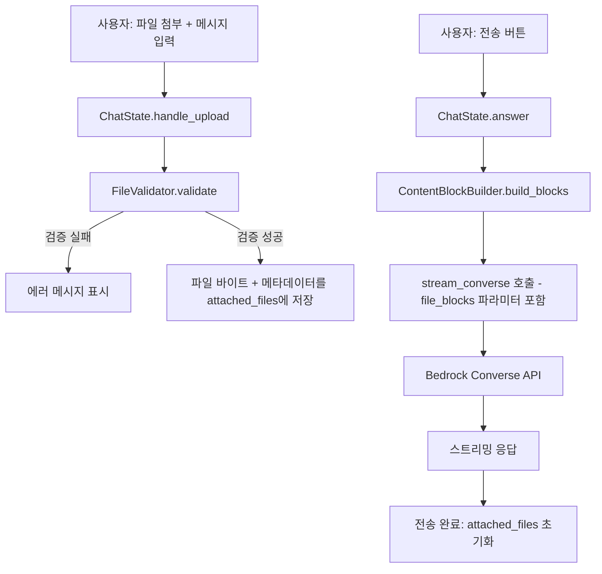
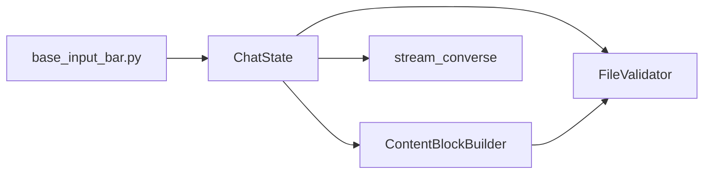

# 설계 문서: 파일 업로드 → LLM 전달

## 개요

WellBot 챗봇에서 사용자가 첨부한 이미지/문서 파일을 AWS Bedrock Converse API를 통해 LLM에 전달하는 기능을 설계한다. 현재 `handle_upload`는 파일명만 저장하고 있으며, 이를 확장하여 파일 바이트 데이터를 메모리에서 직접 읽고, 검증하고, Converse API content block 형식으로 변환하여 `stream_converse`에 전달하는 전체 파이프라인을 구현한다.

핵심 원칙:
- 디스크 저장 없이 메모리에서만 파일 처리 (보안 및 동시성)
- Bedrock Converse API 제한(확장자, 크기, 개수)을 업로드 시점에 사전 검증
- 기존 텍스트 전용 흐름과 완전한 하위 호환성 유지

## 아키텍처



전체 흐름은 3단계로 구성된다:

1. **업로드 단계**: `handle_upload` → `FileValidator` → 메모리 저장
2. **변환 단계**: `ContentBlockBuilder` → ImageBlock / DocumentBlock 생성
3. **전송 단계**: `stream_converse` 확장 → API 호출 → 메모리 정리

## 컴포넌트 및 인터페이스

### 1. FileValidator (wellbot/services/file_validator.py)

파일 검증을 담당하는 순수 함수 모듈. ChatState와 분리하여 테스트 용이성을 확보한다.

```python
# 상수 정의
IMAGE_EXTENSIONS: set[str] = {"png", "jpeg", "jpg", "gif", "webp"}
DOCUMENT_EXTENSIONS: set[str] = {"pdf", "csv", "doc", "docx", "xls", "xlsx", "html", "txt", "md"}
IMAGE_MAX_SIZE: int = 3_932_160       # 3.75 MB
DOCUMENT_MAX_SIZE: int = 4_718_592    # 4.5 MB
IMAGE_MAX_COUNT: int = 20
DOCUMENT_MAX_COUNT: int = 5

def classify_file(filename: str) -> str:
    """파일 확장자로 타입 분류. 반환값: 'image' | 'document'
    지원되지 않는 확장자는 ValueError 발생."""

def validate_file(
    filename: str,
    file_size: int,
    current_image_count: int,
    current_document_count: int,
) -> None:
    """파일 검증 (확장자, 크기, 개수). 실패 시 ValueError 발생."""
```

### 2. ContentBlockBuilder (wellbot/services/content_block_builder.py)

첨부 파일을 Converse API content block 형식으로 변환하는 모듈.

```python
@dataclass
class AttachedFile:
    filename: str
    data: bytes
    file_type: str  # 'image' | 'document'

def build_content_blocks(files: list[AttachedFile]) -> list[dict]:
    """AttachedFile 목록을 Converse API content block 목록으로 변환.
    - 이미지 → ImageBlock
    - 문서 → DocumentBlock
    변환 실패한 파일은 건너뛰고 나머지만 반환."""
```

### 3. ChatState 확장 (wellbot/state/chat.py)

기존 `ChatState` 클래스를 수정한다.

```python
# attached_files 타입 변경: list[str] → list[dict]
# dict 구조: {"filename": str, "data": bytes, "file_type": str}
attached_files: list[dict] = []
upload_error: str = ""

async def handle_upload(self, files: list[rx.UploadFile]):
    """파일 업로드 처리 - 검증 후 바이트 데이터를 메모리에 저장"""

async def answer(self):
    """메시지 전송 - content block 빌드 후 stream_converse 호출, 완료 후 정리"""
```

### 4. stream_converse 확장 (wellbot/services/llm.py)

```python
def stream_converse(
    messages: list[tuple[str, str]],
    current_question: str,
    model_id: str,
    # ... 기존 파라미터 ...
    file_blocks: list[dict] | None = None,  # 새 파라미터
) -> Generator[str, None, None]:
    """file_blocks가 전달되면 현재 user 메시지의 content 배열에 포함"""
```

### 컴포넌트 간 의존 관계



## 데이터 모델

### AttachedFile (메모리 내 파일 표현)

| 필드 | 타입 | 설명 |
|------|------|------|
| filename | str | 원본 파일명 (예: "report.pdf") |
| data | bytes | 파일 바이트 데이터 (raw bytes) |
| file_type | str | 'image' 또는 'document' |

> Reflex State는 `bytes` 타입을 직접 직렬화할 수 없으므로, `attached_files`는 `list[dict]` 형태로 관리하되 실제 바이트 데이터는 별도의 인스턴스 변수(`_file_data: dict[str, bytes]`)로 관리한다. State에는 파일명과 타입 정보만 저장하고, UI 렌더링에 필요한 최소 정보만 노출한다.

### ChatState 상태 변경

| 필드 | 변경 전 | 변경 후 | 설명 |
|------|---------|---------|------|
| attached_files | `list[str]` | `list[dict]` | `{"filename": str, "file_type": str}` |
| _file_data | (없음) | `dict[str, bytes]` | 파일명 → 바이트 매핑 (비직렬화 필드) |
| upload_error | (없음) | `str` | 검증 실패 시 에러 메시지 |

### Converse API Content Block 형식

**ImageBlock:**
```json
{
  "image": {
    "format": "png",
    "source": {
      "bytes": "<base64_encoded_bytes>"
    }
  }
}
```

**DocumentBlock:**
```json
{
  "document": {
    "name": "report",
    "format": "pdf",
    "source": {
      "bytes": "<base64_encoded_bytes>"
    }
  }
}
```

**문서 포함 시 user 메시지 content 배열 구조:**
```json
[
  {"text": "이 문서를 분석해주세요"},
  {"document": {"name": "report", "format": "pdf", "source": {"bytes": "..."}}}
]
```

> Bedrock Converse API는 문서 블록이 포함된 메시지에 반드시 텍스트 블록이 함께 있어야 한다. 사용자가 텍스트 없이 문서만 첨부한 경우, 기본 텍스트("첨부된 파일을 분석해주세요.")를 자동 삽입한다.


## 정확성 속성 (Correctness Properties)

*속성(property)이란 시스템의 모든 유효한 실행에서 참이어야 하는 특성 또는 동작이다. 속성은 사람이 읽을 수 있는 명세와 기계가 검증할 수 있는 정확성 보장 사이의 다리 역할을 한다.*

### Property 1: 파일 분류 정확성

*For any* 파일명에 대해, 확장자가 이미지 확장자 집합(png, jpeg, jpg, gif, webp)에 속하면 `classify_file`은 `'image'`를 반환하고, 문서 확장자 집합(pdf, csv, doc, docx, xls, xlsx, html, txt, md)에 속하면 `'document'`를 반환하며, 어느 쪽에도 속하지 않으면 `ValueError`를 발생시켜야 한다.

**Validates: Requirements 2.1, 2.2, 2.3**

### Property 2: 크기 제한 검증

*For any* 파일에 대해, 이미지 타입이면서 크기가 3.75MB를 초과하거나, 문서 타입이면서 크기가 4.5MB를 초과하면, `validate_file`은 해당 파일을 거부(ValueError)해야 한다. 반대로 크기가 제한 이내이면 거부하지 않아야 한다.

**Validates: Requirements 3.1, 3.2**

### Property 3: 개수 제한 검증

*For any* 파일 타입과 현재 첨부 개수에 대해, 이미지 타입이면서 현재 이미지 수가 20 이상이거나, 문서 타입이면서 현재 문서 수가 5 이상이면, `validate_file`은 추가 파일을 거부(ValueError)해야 한다. 반대로 개수가 제한 미만이면 거부하지 않아야 한다.

**Validates: Requirements 3.3, 3.4**

### Property 4: Content Block 변환 정확성

*For any* AttachedFile에 대해, 이미지 타입이면 `build_content_blocks`는 `"image"` 키를 가진 블록을 생성하고 올바른 format과 bytes를 포함해야 하며, 문서 타입이면 `"document"` 키를 가진 블록을 생성하고 올바른 name, format, bytes를 포함해야 한다.

**Validates: Requirements 4.1, 4.2**

### Property 5: 문서 포함 시 텍스트 블록 필수

*For any* 문서 타입 파일이 포함된 content block 목록에 대해, `stream_converse`에 전달되는 현재 user 메시지의 content 배열에는 반드시 텍스트 블록(`{"text": ...}`)이 포함되어야 한다.

**Validates: Requirements 4.3**

### Property 6: 메시지 구조 정확성

*For any* 메시지와 file_blocks에 대해, file_blocks가 전달되면 현재 user 메시지의 content 배열에 텍스트 블록과 파일 블록이 모두 포함되어야 하고, file_blocks가 None이면 텍스트 블록만 포함되어야 한다.

**Validates: Requirements 5.2, 5.3**

### Property 7: 전송 후 메모리 정리

*For any* 첨부 파일이 있는 상태에서 메시지 전송이 완료되면(성공 또는 실패), attached_files는 빈 목록이고 _file_data는 빈 딕셔너리여야 한다.

**Validates: Requirements 6.1**

### Property 8: 부분 실패 시 나머지 파일 처리

*For any* AttachedFile 목록에서 일부 파일의 변환이 실패하더라도, `build_content_blocks`는 나머지 정상 파일의 content block을 반환해야 하며, 반환된 블록 수는 정상 파일 수와 같아야 한다.

**Validates: Requirements 7.4**

## 에러 처리

### 업로드 단계 에러

| 에러 상황 | 처리 방식 | 사용자 메시지 |
|-----------|-----------|---------------|
| 지원되지 않는 확장자 | `handle_upload`에서 거부 | "지원되지 않는 파일 형식입니다. 지원 형식: png, jpeg, jpg, gif, webp, pdf, csv, doc, docx, xls, xlsx, html, txt, md" |
| 이미지 크기 초과 | `handle_upload`에서 거부 | "이미지 파일은 최대 3.75MB까지 업로드할 수 있습니다. ({filename}: {size}MB)" |
| 문서 크기 초과 | `handle_upload`에서 거부 | "문서 파일은 최대 4.5MB까지 업로드할 수 있습니다. ({filename}: {size}MB)" |
| 이미지 개수 초과 | `handle_upload`에서 거부 | "이미지 파일은 최대 20개까지 첨부할 수 있습니다." |
| 문서 개수 초과 | `handle_upload`에서 거부 | "문서 파일은 최대 5개까지 첨부할 수 있습니다." |

### 변환 단계 에러

| 에러 상황 | 처리 방식 | 사용자 메시지 |
|-----------|-----------|---------------|
| 파일 읽기/인코딩 실패 | 해당 파일 건너뛰기 | "일부 파일({filename})을 처리할 수 없어 제외되었습니다." |

### 전송 단계 에러

| 에러 상황 | 처리 방식 | 사용자 메시지 |
|-----------|-----------|---------------|
| Bedrock API 호출 실패 | 기존 에러 처리 유지 | "오류가 발생했습니다: {error}" |

에러 메시지는 `ChatState.upload_error` 상태에 저장되며, UI에서 토스트 또는 인라인 메시지로 표시한다. 에러 발생 시에도 `attached_files`는 유지되어 사용자가 문제 파일만 제거하고 재시도할 수 있도록 한다. 단, 전송 완료 후에는 항상 초기화된다.

## 테스트 전략

### 속성 기반 테스트 (Property-Based Testing)

라이브러리: **Hypothesis** (Python)

각 정확성 속성에 대해 하나의 속성 기반 테스트를 작성한다. 최소 100회 반복 실행.

| 테스트 | 대상 속성 | 태그 |
|--------|-----------|------|
| test_classify_file_correctness | Property 1 | Feature: file-upload-to-llm, Property 1: 파일 분류 정확성 |
| test_size_limit_validation | Property 2 | Feature: file-upload-to-llm, Property 2: 크기 제한 검증 |
| test_count_limit_validation | Property 3 | Feature: file-upload-to-llm, Property 3: 개수 제한 검증 |
| test_content_block_conversion | Property 4 | Feature: file-upload-to-llm, Property 4: Content Block 변환 정확성 |
| test_document_requires_text_block | Property 5 | Feature: file-upload-to-llm, Property 5: 문서 포함 시 텍스트 블록 필수 |
| test_message_structure | Property 6 | Feature: file-upload-to-llm, Property 6: 메시지 구조 정확성 |
| test_cleanup_after_send | Property 7 | Feature: file-upload-to-llm, Property 7: 전송 후 메모리 정리 |
| test_partial_failure_handling | Property 8 | Feature: file-upload-to-llm, Property 8: 부분 실패 시 나머지 파일 처리 |

### 단위 테스트 (Unit Tests)

속성 기반 테스트가 커버하지 않는 구체적 예시와 엣지 케이스를 단위 테스트로 보완한다.

- **에러 메시지 검증**: 지원되지 않는 확장자, 크기 초과, 개수 초과 시 정확한 에러 메시지 문자열 확인 (Requirements 7.1, 7.2, 7.3)
- **jpg → jpeg 매핑**: ImageBlock의 format 필드에서 jpg가 jpeg로 변환되는지 확인
- **문서 없이 텍스트만 전송**: file_blocks=None일 때 기존 동작과 동일한지 확인
- **빈 파일명 처리**: 파일명이 빈 문자열이거나 확장자가 없는 경우 처리
- **중복 파일명 업로드**: 동일 파일명으로 재업로드 시 덮어쓰기 동작 확인
- **문서만 첨부 시 기본 텍스트 삽입**: 사용자 텍스트 없이 문서만 첨부한 경우 기본 텍스트가 삽입되는지 확인

### 테스트 설정

```python
# pytest + hypothesis
# settings: max_examples=100 (최소)
from hypothesis import given, settings, strategies as st

@settings(max_examples=100)
@given(...)
def test_classify_file_correctness(...):
    # Feature: file-upload-to-llm, Property 1: 파일 분류 정확성
    ...
```
